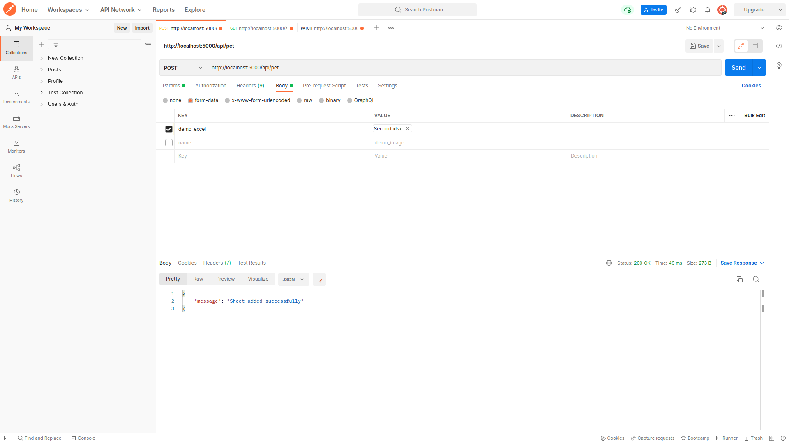

# FASTJOBS
In this repository I have created 5 API's as said in the document.

# Steps to start the node server
```
npm install
npm run server
```

# Postman view of POST route “/api/pet” to add pets from an excel file
```

```

# Tools and libraries used
I used Node.js, MongoDB, and Express to develop this project.
When a Post request was made in NodeJs, I utilised Multer to save the excel file to the storage. However, before the data is stored in the database, it is run by a validator, which determines whether all four fields are present.
These four fields can be validated with the help of a database so that we don't have to update our code in the future, for example, if a customer names their pet "Steel" which is definitely not a breed name. To avoid making mistakes like these, we may create a table in our database that keeps track of all the breeds, and whenever a client enters data, it is compared to the record in the table. 